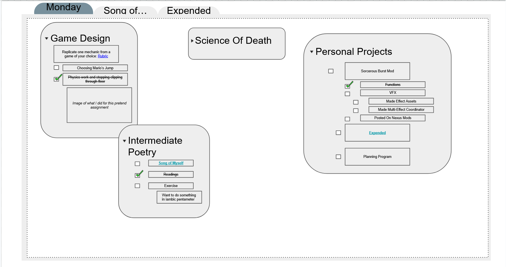
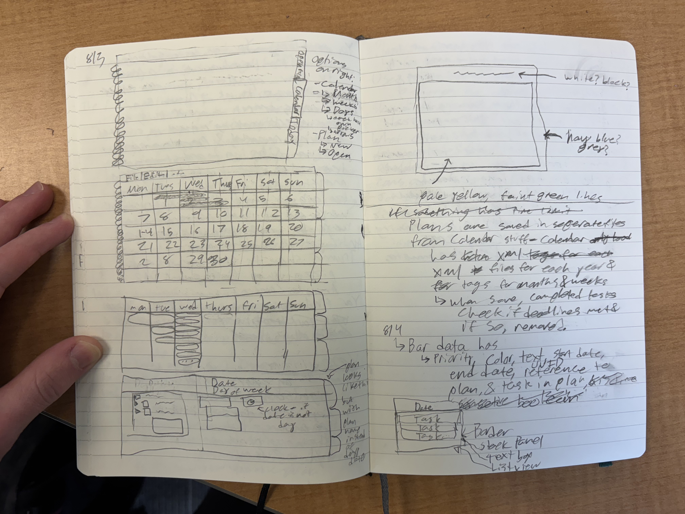
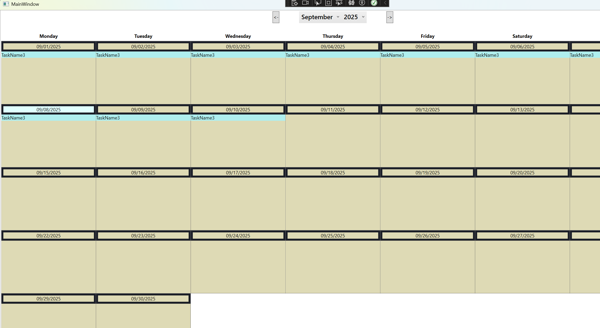
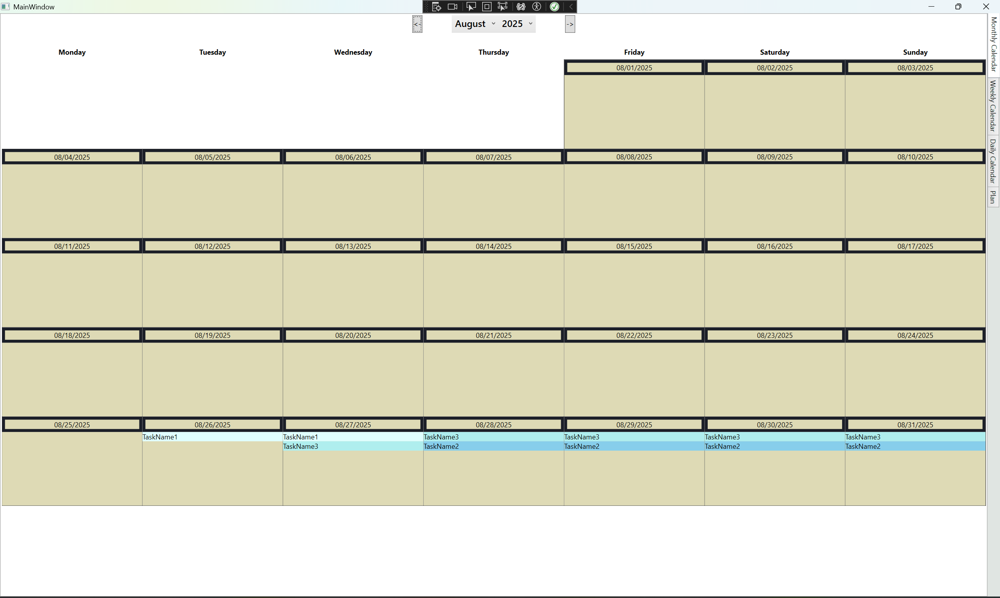
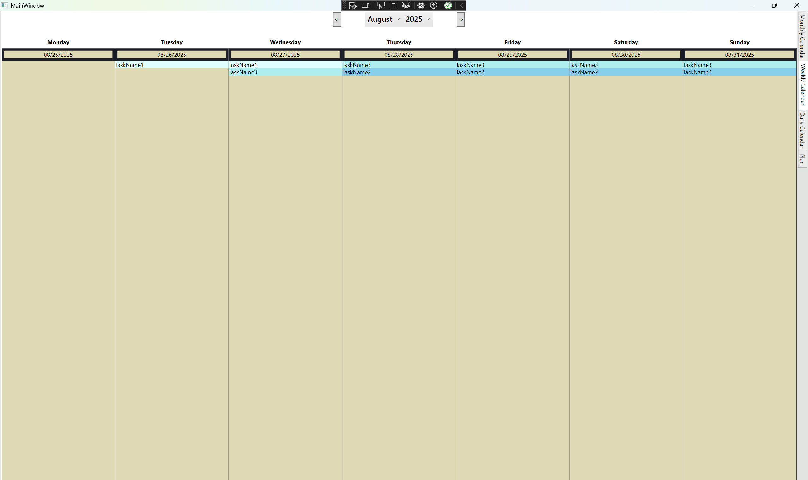
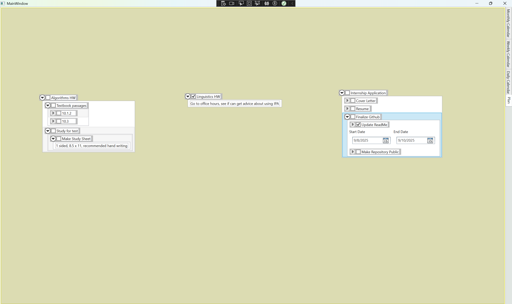

# Goals:
  - When I began my first attempt, I had big ideas that I had no clue how to create. The core of the program has stayed largely the same in each attempt:
    - I wanted to create a program where I could create files in which I could list and break down my tasks into smaller "sub-items" that could then too be further broken down - as needed - into sub-items of their own.
      - I wanted to be able to expand or collapse these tasks so their sub-tasks would not be visible if I didn't want them to be, thereby decreasing visual clutter and help me figure out my most immediate goals.
    - Examples of subtasks or "subtask-information" would include: 
      - I wanted to be to add more details to these tasks, such as being able to put images or descriptions that could further explain them.
      - If these items were in some way time sensetive, I wanted to be able to display them on a calendar.
      - I wanted to be able to link to other "plans" or tasks in "plans" (the file I want to create) if I felt a task could be further broken down into smaller parts (such as when I'm planning out features for games).
      - I wanted to be able to move these tasks around within their respetive plans, and to move the user's perspective around such that there could be tasks in the file that are not displayed in the plan, enabling rearranging of items on screen, and allowing for more tasks to be packed into one plan.
- Here is an example of what I had envisioned from my second attempt during Sophomore year. I used examples pulled from my workload and projects from the time:

  - At the start of August, I realized that I wanted this tool to replace my paper planner to help me stay better organized without stressing myself out needlessly because the box for today got filled up with lots of description for the one thing I had to do (exagerating for the sake of the example).
    - After this realization, I made another visualization of what I was hoping to create, as shown below (apologies for the poor drawing and lack of alt-text right now, I plan to add them later):
  

# How I'm going to accomplish this/How Will It All Work:
- I am using the MVVM programming pattern, along with C#, and the WPF framework, to create this program, and most of the functionality.
- To store data, I will be using XML to store the individual plans, and an SQLite database to store the data for a calendar to display timesensetive tasks
  - There will be more information on the SQLite database's design soon.
  - SQLite was used because I needed something that could store lots of data, and that I could query to find, update, add, or delete data from, while also allowing users to store their data on their computers

  
More In Depth Explanation (that is admittedly not the best written)

  <ul>
   * There are two major parts that I haven't yet (fully) implemented and won't fully be explained in the code. These are how I will be saving the plans and tasks, and how tasks will get displayed to the screen on the calendar(s).  </li>
    * My plan for handling saving data is to store the plans and the tasks in XML, where everything is kind of nested together in a hierarchy of \[PLAN\]-->\[TASK\]-->\[SUBITEMS\]-->\[SUBITEMS' SUBITEMS\], where each of those items listed will have lists of the items next in the hierarchy (in a way, similar to a linked-list or a tree). When displayed in a plan - not on the calendars - it will be roughly similar in structure, just using code.  
      * it should be made clear that each of the above have their own lists, so the plan "knows" only of the tasks that are its immediate children, the first task on that list only knows of the items that are its immediate children, and so on
      * I am aware of how many lists - especially observable collections - there are between the tasks (and subitems - they use the same code) and plans. I plan to refactor this when I find the time, but first I want to get a prototype going  
      * I am using XML because I have worked with it more than I have JSON, though I've worked with both relatively few times, I have used the former when making mods for Baldur's Gate 3.  
      * Each task/sub-task is intended to have a GUID tied to it, for identification by the calendar.  
        * This is so I can search through files for data tied to tasks and/or open plans by clicking on the the tasks displayed in the calendar or by clicking on a linked task within another plan.  
    * My plan for displaying any tasks that are "time sensetive" has 3 parts.  
      * The first part is the calendars themselves and the CalendarTask related classes - these will ideally (when clicked) enable users to open corresponding plans, add the task to a plan if it doesn't have a file, delete the task from the calendar if it doesn't have a corresponding file, or delete the task in question from the calendar.  
      * The second part is the sqlite database. There will only be one total for each download of the program, and it will hold all the data for tasks that need to be displayed on the calendar(s).  
      * The third part is the date-duration sub-item. This control can be a sub-item for any task, and it will access the data for the task that it is a child of. When a plan is saved, the control will call an event to add its information to the sqlite database.  
        * Currently, the data these store are the filepath of the file the task they are a child of is in, the name for the task that is their parent, a guid, the date the task starts, the date the task ends, and whether or not the task is completed.  
    * As of right now, any classes or objects or files (including the sqlite database) that will contain state for the plans or children of the plans are in somewhat of a state of flux, as there are things that as I get closer to making a prototype I will change - one example is that the sqlite database has some filetypes I will eventually need to change.
  </ul>

# What Resources I have used:
  - As this project has had a massive learning curve, and is pretty large in terms of scope, I have had to consult a variety of resources to get it to even this point.
      - For help and advice, I have gone to one of the computer science professors at my college, as he teaches a course on software development.
      - For help and advice on databases, I have gone to one of my professors who has taught me about working with databases. 
      - I have also frequently used articles on CodeProject in order to better understand WPF and some of the code I am writing.
      - I have also made frequent usage of the documentation for C# and WPF, as one of my first resources when things go wrong, or just to understand the features of WPF and C#.
  - I have used a lot of online resources - including things like stack overflow questions - to figure out how to do what I want to do, and to understand what's going wrong
      - Much of the code I have used from online has links to where I got them from commented in my code, so I can go back and see what others did, and to better understand why I did what I have done.
          - My general rule is to try to understand any code I have copied, but sometimes it is best to know where I got code from too, as code from online can sometimes be unoptimized or have its own issues. Or, if I wish to go back to it in cases I forget why I did something, I would like to be able to do so. For this reason, I have commented into my code links where I got some information from where applicable.
          - I frequently found myself having to tweak code from online to fit my own needs, so nothing is fully taken from online and pasted as it was completely.
          - I try to learn from the code I take from online, rather than to just copy paste it - if I'm really not understanding something, I'll even go so far as to write it line by line until I understand it.

# Things that are done when it comes to the goal of making a prototype:
  - Models and view models and views for the tasks and sub-tasks - done for now
  - Getting tasks for calendars - the methods for fetching the tasks and querying the database for this purpose is complete
  - Plan view - done for now but will return to later
  - Can add sub-items to tasks, and can add items to plans

## Images Of What Works

# Completed goals:
- Saving and Loading plans (10/27/2025)
- Polishing drag and drop  (10/27/2025)
- Can zoom in plan view (10/25/2025)
- Improving models and view models (done during October 2025, had not set out to do so, just happened)

# Long term/out of reach for now goals:
These are goals of mine that are not priorities and won't be any time soon until after most features for the program are in. Still they are goals because I know they are necessary - but not how to go about implementing, what is necessary, or because I would prefer to seek outside assistance for implementing them. 
- Accessibility
  - Accessibility features are a must have for me if I ever intend to release this software program for money. I don't know how to implement them, or what features I can or can not expect users to want, so for right now I'm tabling them until I have enough features solidified that I don't have to worry about things changing. I would also prefer to have the aid of another person while working on these.
- General Debugging and optimization
  - I have not had the time to do a lot of debugging, and I don't want to be trying to optimize things if they're not causing issues, so once I have prototypes of all the features in, I'll see how it runs and how buggy it is.
- Art and making it look good
  - I'm not an art person. I'd like to learn, but I don't have the time, so I think a faster and better solution to this problem - once again, once a prototype is complete - would be to figure out how I want the program to look and then hire someone to make art for this program. 

# Timeline (of attempts):
  - This is my third attempt at a program that could enable me to emulate and eventually be able to stop using a paper planner.
    - The first two attempts were relatively short lived, and amounted to nothing. The knowledge I'd learned from them was not the most accurate, and I wound up having to rewrite the code from them for this attempt as a result.
    - The first two attempts took place roughly half way through last year, and a year before that (respectively). I ceased working on them due to workload, a lack of understanding, and wanting to prioritize other projects.
    - This third attempt began in the last two weeks of summer break (though I'd been thinking up ideas, and researching ways to implement various parts a week or two before that), and has continued into the fall semester of this academic year. I've worked on it frequently since - but even then, it's not something I can prioritize all of or even most of my time to.
  - I am using this project as a way to learn how to develop software programs using WPF and C#.
      - This project will also help me complete the research I plan to do for my college's honors program. My research will require a software program, and I plan to make one for myself.
